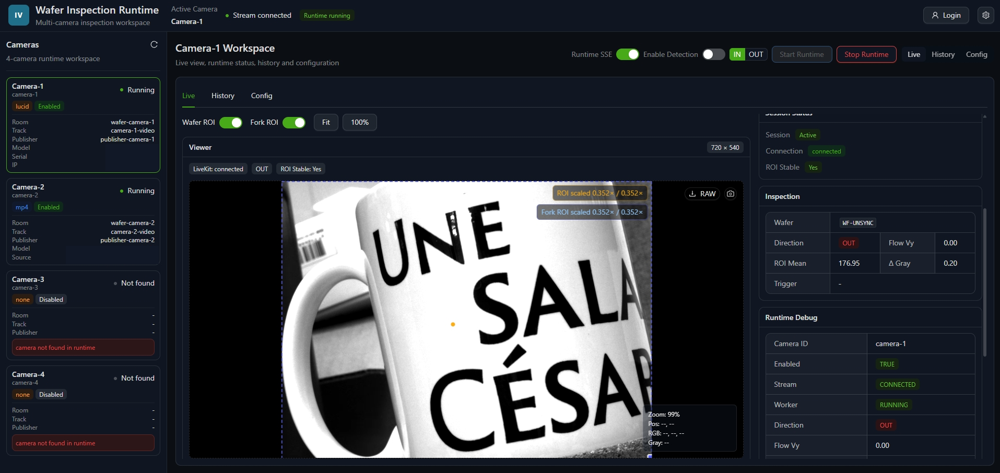
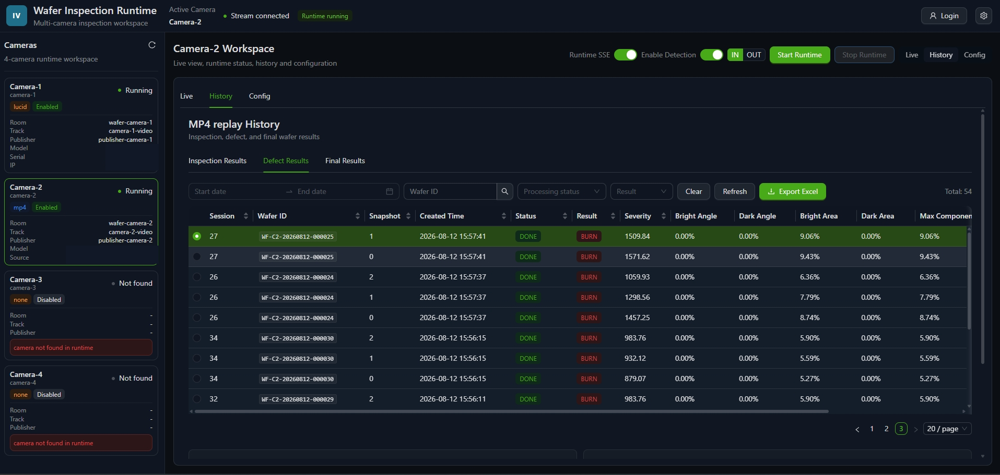

# Industrial Vision Console

A frontend-focused inspection console for viewing real-time camera streams and testing image-processing workflows in an industrial vision setting.

## Author and scope

The application-specific console implementation was developed and maintained by Will Cheng.

This repository is a curated public version of an industrial vision engineering project. It focuses on the shareable frontend architecture and implementation patterns. Production credentials, customer data, device identifiers, internal deployment settings, and raw inspection media are not included.

The original system was developed as part of a larger camera, LiveKit, and wafer-inspection workflow. This public repository is intended to be understandable on its own and does not represent a complete copy of that production environment.

## What it demonstrates

- LiveKit-based multi-camera video viewing
- Camera connection and runtime status display
- Browser-side image-processing controls
- Wafer and fork-region ROI editing in image coordinates
- Zoom, pan, fit-to-view, and grid overlays
- Camera parameter controls through a backend API boundary
- Inspection result and wafer history views
- Configuration panels for ROI, templates, thresholds, and runtime settings
- Localized user interface content

The console is designed as an operator-oriented engineering tool. It is not a cloud SaaS application and does not include a public camera publisher or wafer runtime backend.

## Interface



The live workspace combines the incoming video track with ROI overlays, session state, motion indicators, and runtime diagnostics returned by the backend. Camera identifiers used for routing remain visible, while device-specific serial, network, and local-path details are covered in the public screenshot. The generic camera frame is included only to demonstrate stream and overlay behavior.



The history workspace reads inspection, defect, and final-result records through the runtime API and keeps filtering, pagination, and export actions in the operator console. The displayed rows were generated with simulated wafer input for integration testing; they are not customer or production records. Physical-device and workstation details remain covered.

## Architecture

```text
LiveKit video tracks
        |
        v
React + TypeScript console
        |
        +-- video viewer and stream status
        +-- ROI overlays and coordinate mapping
        +-- browser-side image inspection controls
        +-- camera and inspection API clients
        +-- history and configuration views
```

The camera publisher and backend services are separate system components. A public demo should provide a compatible LiveKit publisher and token service outside this frontend repository. The frontend should not contain LiveKit API secrets.

## Technology

- React
- TypeScript
- Vite
- Ant Design
- LiveKit Client SDK
- Zustand
- OpenCV-compatible browser processing components

## Local development

```bash
npm install
npm run dev
```

The Vite development server starts on port `5173` by default. The current development proxy expects compatible local services for camera APIs and LiveKit token requests. A standalone publisher or mock-data service is intentionally kept outside this frontend snapshot.

The viewer uses the room returned by `GET /api/cameras`. If no room is returned, it follows the bridge convention `wafer-<camera-id>`. Copy `.env.example` and set `VITE_LIVEKIT_URL` for local development. A deployment can override the same value with `window.__APP_CONFIG__.VITE_LIVEKIT_URL`.

The Vite development proxy forwards `/api` and `/data` to the wafer-runtime service at port `8000`, and `/token` to the bridge token service at port `8081`. These are local development defaults and can be changed in `vite.config.ts`.

## Verification

The curated snapshot currently passes the TypeScript and production bundle build:

```bash
npm run build
```

`npm run lint` currently reports 12 errors and 12 warnings in several editor, viewer, and configuration components. The AppLayout hook order, LiveKit token lifecycle, and viewer resource cleanup have been corrected, while the remaining findings are recorded as later quality-hardening work.

`npm audit` currently reports 11 dependency findings: 1 low, 1 moderate, and 9 high. No automatic audit fix has been applied because dependency upgrades require a separate compatibility review.

## Public limitations

- A real Lucid camera source is not included in this frontend repository.
- A LiveKit deployment and token service are not included.
- A wafer-runtime backend is not included.
- Production images, wafer identifiers, recipes, camera serials, and customer configuration are not included.
- The public snapshot uses a curated history rather than the original internal development history.
- No open-source license is attached while ownership and disclosure review is in progress.

## Related system components

This console is intended to connect to two separate components in the broader industrial vision system:

- a camera bridge that publishes Lucid camera frames through LiveKit
- a wafer runtime that manages sessions, inspection state, results, and report export

Clean local snapshots of both components have been prepared. Public cross-repository links and an overview repository remain pending disclosure review and Windows integration testing.
